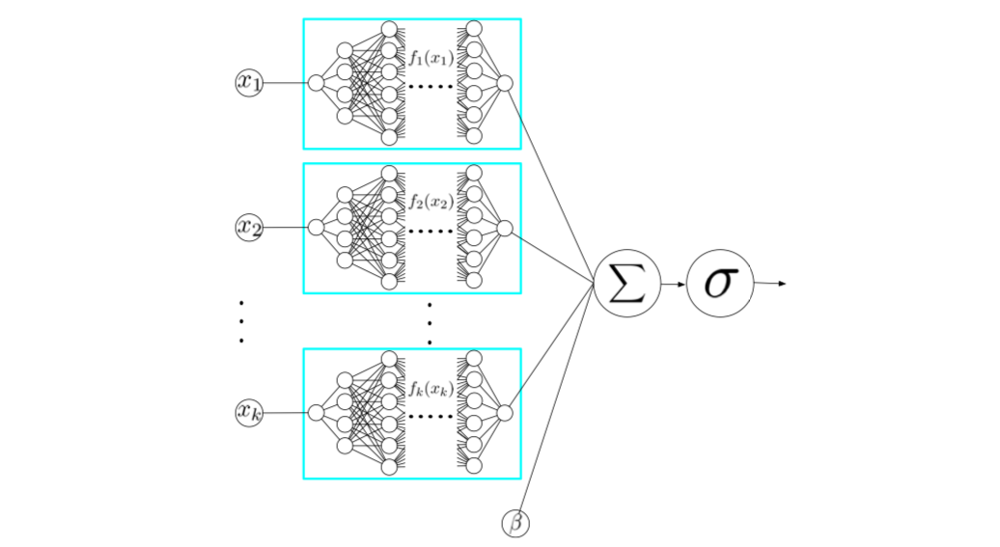

# nam-pytorch
Unofficial PyTorch implementation of Neural Additive Models (NAM) ([`abs`](https://arxiv.org/abs/2004.13912), [`pdf`](https://arxiv.org/pdf/2004.13912.pdf)) by Agarwal, et al.



---

## Installation
You can access `nam-pytorch` via `pip`:

```bash
pip install nam-pytorch
```

## Usage

```python
import torch 
from nam_pytorch import NAM

nam = NAM(784)
x = torch.rand(32, 784)
y = nam(x) # [32, 1]
```

## Contributing
As always, if there are any issues with / suggestions for the code, feel free to raise an issue or submit a PR.

## License
[MIT](https://github.com/rish-16/nam-pytorch/blob/main/LICENSE)